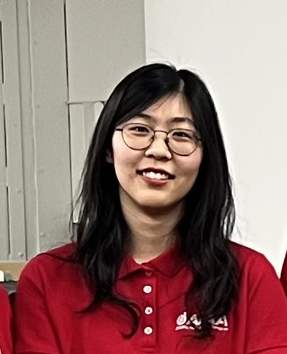

# Cindy

Source: student image cross-referenced against the publication list in `Sid_Most Recent_CV (Jan 2026).pdf`.

Note: Photo filename uses the nickname "Cindy"; publication matching was done against "Xinyu Gao" from the CV.

## Publications

### 1. Experimental Investigation of a Novel Morphing Wing Design.

- Citation: 52. Pabon, Julian A., Xinyu Gao, Jielong Cai, and Sidaard Gunasekaran. "Experimental Investigation of a Novel Morphing Wing Design." In AIAA 2023 Region III Student Conference, Dayton, OH https://doi.org/10.2514/6.2023-71704
- DOI: https://doi.org/10.2514/6.2023-71704
- Short abstract: Short summary unavailable from DOI metadata. This work focuses on experimental investigation of a novel morphing wing design.

### 2. Experimental Investigation of a Novel Morphing Wing Design.

- Citation: 60. Pabon, Julian A., Xinyu Gao, Jielong Cai, and Sidaard Gunasekaran. "Experimental Investigation of a Novel Morphing Wing Design." In AIAA SCITECH 2024 Forum, p. 1349. 2024. https://doi.org/10.2514/6.2024-1349
- DOI: https://doi.org/10.2514/6.2024-1349
- Short abstract: The aerodynamic performance of a novel Fishbone Skin-Actuated-Camber (SAC) morphing wing design, which actuates its skin to change its effective camber, was studied both experimentally and numerically. Force-based experiments were conducted at the University of Dayton Low Speed Wind Tunnel (UD-LSWT) to compare the performance of four morphing wing designs with different hinge locations, two ideal trailing edge flap wings, and one conventional trailing edge flap wing.
