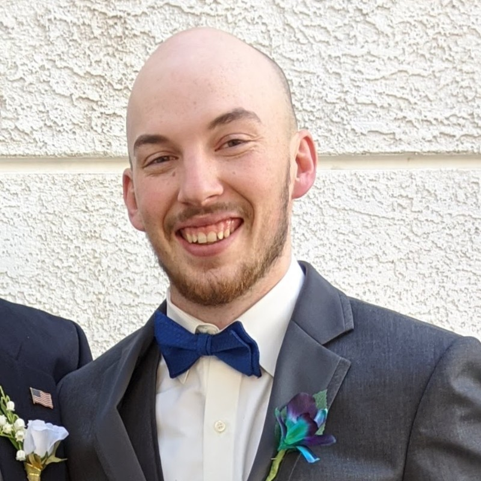

# Daniel Curry

Source: student image cross-referenced against the publication list in `Sid_Most Recent_CV (Jan 2026).pdf`.

## Publications

### 1. Getting EML Off the Ground: Why Do Jets Fly So High?

- Citation: 1. Gunasekaran, Sidaard and Doug Melton. “Getting EML Off the Ground: Why Do Jets Fly So High?”. KEEN Magazine, p 08. 2017 (http://online.fliphtml5.com/zyet/ykie/#p=8) Peer-Review Journal Articles Published: 1. Gunasekaran, Sidaard, and Daniel Curry. "On the Wake Properties of Segmented Trailing Edge Extensions." Aerospace 5, no. 3 (2018): 89. https://doi.org/10.3390/aerospace5030089
- DOI: https://doi.org/10.3390/aerospace5030089
- Short abstract: Changes in the amount and the distribution of mean and turbulent quantities in the free shear layer wake of a 2D National Advisory Committee for Aeronautics (NACA) 0012 airfoil and an AR 4 NACA 0012 wing with passive segmented rigid trailing edge (TE) extensions were investigated at the University of Dayton Low Speed Wind Tunnel (UD-LSWT). The TE extensions were intentionally placed at zero degrees with respect to the chord line to study the effects of segmented extensions without changing the effective angle of attack.

### 2. Effect of Segmented Trailing Edge Extensions on Aerodynamic Efficiency.

- Citation: 12. Gunasekaran, Sidaard and Daniel Curry. "Effect of Segmented Trailing Edge Extensions on Aerodynamic Efficiency." 2018 AIAA Aerospace Sciences Meeting, AIAA 2018-0343. https://doi.org/10.2514/6.2018-0343
- DOI: https://doi.org/10.2514/6.2018-0343
- Short abstract: Short summary unavailable from DOI metadata. This work focuses on effect of segmented trailing edge extensions on aerodynamic efficiency.

### 3. Integrated Teaching Model: A Follow Up with Fundamental Aerodynamics.

- Citation: 14. Gunasekaran, Sidaard. "Integrated Teaching Model: A Follow Up with Fundamental Aerodynamics." ASEE Annual Conference and Exposition. 2018. https://peer.asee.org/30677 15. Gunasekaran, Sidaard, Grant V. Ross, and Daniel Curry. "Effect of Flexible Inverted PVDF in Free Shear Layer Wake." In AIAA Scitech 2019 Forum, p. 1338. 2019. https://doi.org/10.2514/6.2019-1338
- DOI: https://doi.org/10.2514/6.2019-1338
- Short abstract: Short summary unavailable from DOI metadata. This work focuses on integrated teaching model: a follow up with fundamental aerodynamics.
