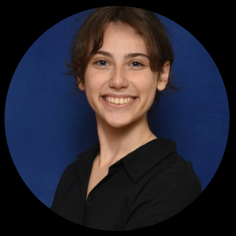

# Grace Schreyer

Source: student image cross-referenced against the publication list in `Sid_Most Recent_CV (Jan 2026).pdf`.

## Publications

### 1. Experimental Investigation of Prandtl-D3 Near Wake Signature.

- Citation: 69. Pabon, Julian A., Grace Schreyer, Sidaard Gunasekaran, Michael Mongin, Aaron Altman, and Patrick Hammer. "Experimental Investigation of Prandtl-D3 Near Wake Signature." In AIAA SCITECH 2025 Forum, p. 2758. 2025. https://doi.org/10.2514/6.2025-2758
- DOI: https://doi.org/10.2514/6.2025-2758
- Short abstract: The disappearance of the tip vortex in the near wake of a wing challenges conventional aerodynamic theories and presents new opportunities for drag reduction. Recent computational studies suggested that the PRANDTL-D3C wing—a swept, multi-element, and tapered wing with a bell-shaped lift distribution—exhibits this tip vortex disappearance.

### 2. Variations in the Wake Structure of Non-Elliptical Lift Distributions Near Wingtip.

- Citation: 72. Schreyer, Grace A., Sidaard Gunasekaran, Julian A. Pabon, and Jielong Cai. "Variations in the Wake Structure of Non-Elliptical Lift Distributions Near Wingtip." In AIAA SCITECH 2025 Forum, p. 0253. 2025. https://doi.org/10.2514/6.2025-0253
- DOI: https://doi.org/10.2514/6.2025-0253
- Short abstract: Non-elliptical lift distributions, particularly bell-shaped distributions with extended spans, have shown potential to disrupt conventional tip vortex roll-up, even eliminating trailing vortices in the near wake. This study investigates the aerodynamic performance and near-wake characteristics of four wing configurations: a baseline untwisted wing, an elliptically loaded wing, and two nonelliptical lift distributions.

### 3. Experimental Investigations of a Dual-Mode Skin-Actuated-Camber with Embedded Twist (SACET) Morphing Wing.

- Citation: 77. Schreyer, Grace A., Grace N. Selm, Julian A. Pabon, and Sidaard Gunasekaran. "Experimental Investigations of a Dual-Mode Skin-Actuated-Camber with Embedded Twist (SACET) Morphing Wing." In AIAA SciTech 2026 Forum, p. 0256. 2026. https://doi.org/10.2514/6.2026-0256
- DOI: https://doi.org/10.2514/6.2026-0256
- Short abstract: A dual mode Skin Actuated Camber with Embedded Twist morphing wing is developed to approximate a bell-shaped lift distribution and the associated tip vortex free wake. Three morphing concepts are conceived for a rectangular wing using simple geometric models that link actuator motion to local rib twist.
