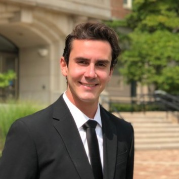

# Joe Ivarson

Source: student image cross-referenced against the publication list in `Sid_Most Recent_CV (Jan 2026).pdf`.

Note: Publication matching was done against "Joseph Ivarson".

## Publications

### 1. Deep Learning Algorithm for Atomization Characterization using Shadowgraph Images

- Citation: 42. B. N. Narayanan, Joseph Ivarson, Lars Maneck, Sidaard Gunasekaran , “Deep Learning Algorithm for Atomization Characterization using Shadowgraph Images”, 2021 IEEE National Aerospace and Electronics Conference (NAECON), Dayton, OH, USA, 2021. 10.1109/NAECON49338.2021.9696443
- DOI: https://doi.org/10.1109/NAECON49338.2021.9696443
- Short abstract: Predicting droplet size distribution as a function of chemical composition, input pressure, nozzle geometry, and atmospheric conditions using algebraic approach is extremely complicated due to the number of variables involved, especially for agricultural spray applications. A low cost shadowgraphy technique was used to capture the spray pattern from six different standard ASABE nozzles (ranging from extremely coarse 6515 type to very fine 11001 nozzle type) at different inlet pressures, along with various combinations of adjuvant mixtures.
