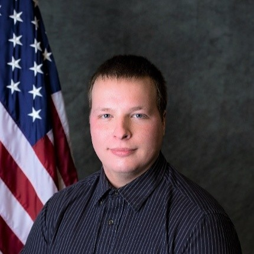

# Matt Gazella

Source: student image cross-referenced against the publication list in `Sid_Most Recent_CV (Jan 2026).pdf`.

## Publications

### 1. Design and Analysis of an Additive Manufactured Supersonic Wind Tunnel.

- Citation: 25. Gazella, Matthew R., Jonathon Hill, Scott Chriss, Austin J. Abel, and Sidaard Gunasekaran. "Design and Analysis of an Additive Manufactured Supersonic Wind Tunnel." In AIAA Scitech 2020 Forum, p. 1354. 2020. https://doi.org/10.2514/6.2020-1354
- DOI: https://doi.org/10.2514/6.2020-1354
- Short abstract: For decades, supersonic wind tunnels have been designed and fabricated using common metallic materials for structural integrity. With advancements in additive manufacturing technology, high-performance thermoplastics are being developed as an alternative to steel that offer excellent strength and thermal stability.
