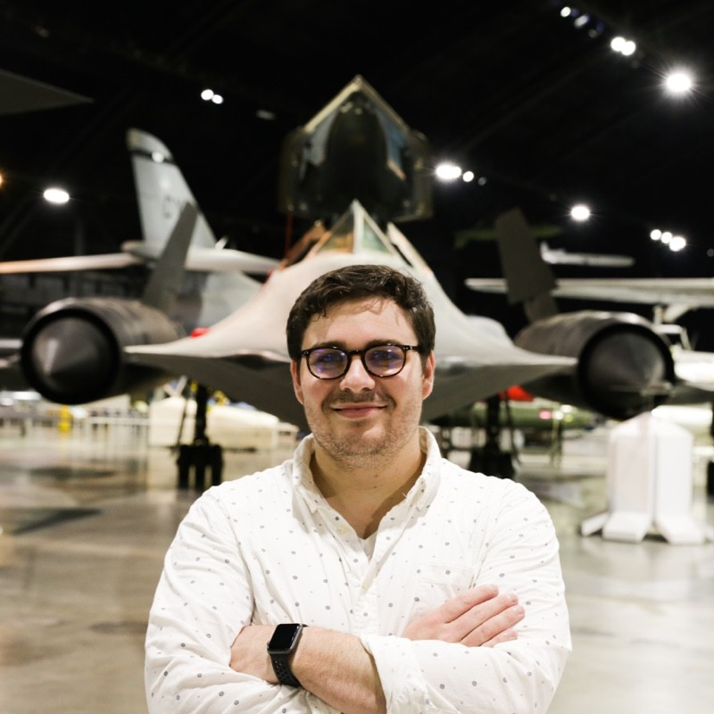

# Michael Mongin

Source: student image cross-referenced against the publication list in `Sid_Most Recent_CV (Jan 2026).pdf`.

## Publications

### 1. Effect of Airfoil-Preserved Undulation Placement on Wing Performance and Wingtip Vortex

- Citation: 5. Loughnane, Faith, Michael Mongin, Sidaard Gunasekaran, “Effect of Airfoil-Preserved Undulation Placement on Wing Performance and Wingtip Vortex”, AIAA Journal https://doi.org/10.2514/1.J059517
- DOI: https://doi.org/10.2514/1.J059517
- Short abstract: The effect of undulation placement (leading edge, trailing edge, or leading and trailing edges) on the wing performance and the wingtip vortex was investigated. Experiments were performed at the University of Dayton Low-Speed Wind Tunnel on undulated wings where the NACA 0012 airfoil cross section is preserved along the wingspan.

### 2. KF-PEV: a causal Kalman filter-based particle event velocimetry.

- Citation: 12. AlSattam, Osama, Michael Mongin, Mitchell Grose, Sidaard Gunasekaran, and Keigo Hirakawa. "KF-PEV: a causal Kalman filter-based particle event velocimetry." Experiments in Fluids 65, no. 9 (2024): 141. https://doi.org/10.1007/s00348-024-03877-y
- DOI: https://doi.org/10.1007/s00348-024-03877-y
- Short abstract: Abstract Event-based pixel sensors asynchronously report changes in log-intensity in microsecond-order resolution. Its exceptional speed, cost effectiveness, and sparse event stream make it an attractive imaging modality for particle tracking velocimetry.

### 3. Comparison of Event-Based Alogrithms for Experimental Two-Dimensional, Two-Component Velocimetry.

- Citation: 14. Gunasekaran, Sidaard, Michael Mongin, Osama A. AlSattam, and Keigo Hirakawa. "Comparison of Event-Based Alogrithms for Experimental Two-Dimensional, Two-Component Velocimetry." Journal of Aircraft (2025): 1-15. https://doi.org/10.2514/1.C038412
- DOI: https://doi.org/10.2514/1.C038412
- Short abstract: Event-based cameras, which operate without traditional frames and instead capture asynchronous changes in intensity, offer a transformative approach to flow diagnostics. This study investigates the application of event-based methods for velocimetry around an SD7003 wing and compares their performance to traditional particle image velocimetry (PIV).

### 4. Effect of Airfoil- Preserved Undulations on Wing Performance.

- Citation: 21. Loughnane, Faith A., Rachael Supina, Michael P. Mongin, and Sidaard Gunasekaran. "Effect of Airfoil- Preserved Undulations on Wing Performance." In AIAA Scitech 2020 Forum, p. 1784. 2020. https://doi.org/10.2514/6.2020-1784
- DOI: https://doi.org/10.2514/6.2020-1784
- Short abstract: Most leading-edge tubercles studies involve serrated-type or undulated leading edges where the airfoil cross-section is destroyed unintentionally. Experimental investigations were performed at the University of Dayton Low Speed Wind Tunnel (UD-LSWT) on an undulated wing where the NACA 0012 airfoil cross-section is preserved along the wingspan.

### 5. Frequency Response of a Shuttered Open Jet Wind Tunnel.

- Citation: 22. Cook, Thomas, Sidaard Gunasekaran, Michael V. Ol, and Michael P. Mongin. "Frequency Response of a Shuttered Open Jet Wind Tunnel." In AIAA Scitech 2020 Forum, p. 1760. 2020. https://doi.org/10.2514/6.2020-1760
- DOI: https://doi.org/10.2514/6.2020-1760
- Short abstract: Steady and unsteady response of an open-jet Eiffel-type wind tunnel to a shuttering system was investigated using hot wire anemometry and flow visualization. Vertical shutters (louvers) were installed in the diffuser behind the test section.

### 6. Lift Regulation Using Closed-Loop Feedback and Control.

- Citation: 28. Mongin, Michael P., and Sidaard Gunasekaran. "Lift Regulation Using Closed-Loop Feedback and Control." In AIAA Scitech 2021 Forum, p. 2000. 2021. https://doi.org/10.2514/6.2021-2000
- DOI: https://doi.org/10.2514/6.2021-2000
- Short abstract: A closed-loop feedback control system tuned by a PID controller was designed and built to achieve a target lift coefficient in both steady state as well as unsteady lift coefficient variation at reduced frequencies ranging from 0.05 to 0.3 at the University of Dayton Water Tunnel. Through the integration of a dSPACE MicroLabBox with a linear actuator and a force sensor, a semi-span AR 2.5 NACA 0015 wing was actuated using closed loop control to achieve a desired lift coefficient condition.

### 7. Effect of Airfoil-Preserved Undulations on Free Shear Layer.

- Citation: 33. Loughnane, Faith A., Michael P. Mongin, and Sidaard Gunasekaran. "Effect of Airfoil-Preserved Undulations on Free Shear Layer." In AIAA Scitech 2021 Forum, p. 0847. 2021. https://doi.org/10.2514/6.2021-0847
- DOI: https://doi.org/10.2514/6.2021-0847
- Short abstract: The distribution of mean and fluctuating quantities in the free shear layer wake of airfoil-preserved undulated wings are investigated using Particle Image Velocimetry (PIV) at the University of Dayton Low Speed Wind Tunnel (UD-LSWT). Prior work on wings with airfoil-preserved undulations revealed that wings with trailing edge undulations and wings with leading and trailing edge undulations had higher aerodynamic efficiency than the wings with leading edge undulations.

### 8. High Amplitude Lift Tracking Using Closed-Loop Feedback and Control.

- Citation: 41. Mongin, Michael P., Sidaard Gunasekaran, Albert Medina, Raul Ordonez, and Andrew Killian. "High Amplitude Lift Tracking Using Closed-Loop Feedback and Control." In AIAA SCITECH 2022 Forum, p. 0046. 2022. https://doi.org/10.2514/6.2022-0046
- DOI: https://doi.org/10.2514/6.2022-0046
- Short abstract: Two closed-loop feedback controllers based on PID and on full state-feedback were developed for high amplitude coefficient of lift tracking to expand the control capability of a pitching flat plate beyond the point of attached flow. All experiments were conducted at the University of Dayton Water Tunnel (UDWT) at a Reynolds number of 54,000.

### 9. Propeller Ground and Ceiling Effect in Forward Flight

- Citation: 43. Cai, Jielong., Sidaard Gunasekaran, “Propeller Ground and Ceiling Effect in Forward Flight”, Vertical Flight Society, Forum 78, Dallas, TX, USA, 2022. SKU # 78-2022-0072-Cai 44. Killian, Andrew, Sidaard Gunasekaran, Michael P. Mongin, and Albert Medina. "Periodic Vortical Gust Encounter and Mitigation Using Closed Loop Control." In AIAA SCITECH 2023 Forum, p. 2477. 2023. https://doi.org/10.2514/6.2023-2477
- DOI: https://doi.org/10.2514/6.2023-2477
- Short abstract: A wing’s response to periodic vortical gusts of different frequencies and magnitudes was investigated and controlled using a PID based closed loop control system. All experiments were conducted in the University of Dayton Water Tunnel (UD-WaT).

### 10. High Amplitude Lift Tracking Using Closed-Loop Feedback and Control; A Flow Analysis.

- Citation: 45. Mongin, Michael P., Albert Medina, Andrew Killian, and Sidaard Gunasekaran. "High Amplitude Lift Tracking Using Closed-Loop Feedback and Control; A Flow Analysis." In AIAA SCITECH 2023 Forum, p. 2476. 2023. https://doi.org/10.2514/6.2023-2476
- DOI: https://doi.org/10.2514/6.2023-2476
- Short abstract: The flow field around a -controlled harmonically pitching flat plate was characterized using Particle Image Velocimetry (PIV). Analysis of the flow field, namely the growth and evolution of the leading-edge vortex (LEV) and other flow features were compared for a -controlled pitching flat plate across different reduced frequencies and amplitudes.

### 11. Aerodynamic Characterization of Wing-Wing Interactions for Distributed Lift Applications.

- Citation: 47. Jestus, Nevin, Sidaard Gunasekaran, Michael P. Mongin, and Aaron Altman. "Aerodynamic Characterization of Wing-Wing Interactions for Distributed Lift Applications." In AIAA SCITECH 2023 Forum, p. 0030. 2023. https://doi.org/10.2514/6.2023-0030
- DOI: https://doi.org/10.2514/6.2023-0030
- Short abstract: Proximity effects due to wing-wing interactions were experimentally quantified as a function of gap and stagger across a wide range of different relative angles of attack (décalage). All experiments were conducted at the University of Dayton Low Speed Wind Tunnel (UD-LSWT) on a pair of Clark-Y AR 2 semi-span wings.

### 12. Extended High Lift Characteristics of Distributed Lift Configurations.

- Citation: 50. Mongin, Michael P., Aaron Altman, and Sidaard Gunasekaran. "Extended High Lift Characteristics of Distributed Lift Configurations." In AIAA SCITECH 2023 Forum, p. 0031. 2023. https://doi.org/10.2514/6.2023-0031
- DOI: https://doi.org/10.2514/6.2023-0031
- Short abstract: By dividing monoplane wing area across numerous multiple smaller lifting surfaces, a suite of new results for both semi-span and full three-dimensional configurations continue to broaden previous understanding derived from earlier semispan experiments. The present study focuses on select configurations to study subscale Reynolds number sensitivity of the effectiveness of the multi-wing layout.

### 13. Aerodynamic Interactions among Three Identical Wings in Close Proximity.

- Citation: 54. Jestus, Nevin, Sidaard Gunasekaran, Michael P. Mongin, and Aaron Altman. "Aerodynamic Interactions among Three Identical Wings in Close Proximity." In AIAA 2023 Region III Student Conference, Dayton, OH https://doi.org/10.2514/6.2023-71488
- DOI: https://doi.org/10.2514/6.2023-71488
- Short abstract: The compactness requirements for modern Unmanned Aerial Vehicles (UAVs) and Private Air Vehicles (PAVs) opens the door for new innovative designs with smaller footprints. Some of the proposed UAV and PAV designs utilize multiple lifting surfaces or rotors in close proximity increasing the need for strategic placement of the wings within close proximity.

### 14. Generation and Characterization of Discrete Vortical Gust

- Citation: 55. Porterfield, Andrew, Andrew Killian, Sidaard Gunasekaran, and Michael Mongin. "Generation and Characterization of Discrete Vortical Gust". In AIAA 2023 Region III Student Conference, Dayton, OH https://doi.org/10.2514/6.2023-71873
- DOI: https://doi.org/10.2514/6.2023-71873
- Short abstract: Discrete vortical gusts with different strengths and trajectories were generated and characterized using Time Resolved Particle Image Velocimetry (TR-PIV) in the University of Dayton Water Tunnel (UD-Wat). The discrete vortical gusts were generated by rapidly pitching a flat plate about its quarter chord.

### 15. Proximity Effects of Wings on System Performance in a Multi-Wing Configuration.

- Citation: 57. Jestus, Nevin, Sidaard Gunasekaran, Michael Mongin, and Aaron Altman. "Proximity Effects of Wings on System Performance in a Multi-Wing Configuration." In AIAA SCITECH 2024 Forum, p. 1908. 2024. https://doi.org/10.2514/6.2024-1908
- DOI: https://doi.org/10.2514/6.2024-1908
- Short abstract: The emergence of compactness requirements in modern Unmanned Aerial Vehicles (UAVs) and Private Air Vehicles (PAVs) has led to the development of new aircraft design concepts, such as Distributed Lift where multiple small span wings are used as a substitute to the conventional large span monowing. Wing-wing interactions were experimentally and numerically quantified as a function of gap and stagger across a wide range of different relative angles of attack (décalage) for two, three, and four-wing configurations.

### 16. Development of an Experimental Testbed to Study Cavity Flow as a Processing Element for Flow Disturbances.

- Citation: 58. Vincent, Timothy, Sidaard Gunasekaran, Michael Mongin, Alberto Medina, Alexander M. Pankonien, and Philip Buskohl. "Development of an Experimental Testbed to Study Cavity Flow as a Processing Element for Flow Disturbances." In AIAA SCITECH 2024 Forum, p. 1732. 2024. https://doi.org/10.2514/6.2024-1732
- DOI: https://doi.org/10.2514/6.2024-1732
- Short abstract: Sensing and responding to local flow phenomena is a key element in advancing the state-of-the-art in control. As advances in flow sensing and active flow control technology are enabling increased sensor density and more effective flow inputs, novel computing concepts are needed to close the loop on self-contained local flow control systems while minimizing size, weight, and power requirements.

### 17. Discrete Vortical Gust Encounter and Mitigation using Closed Loop Control.

- Citation: 62. Porterfield, Andrew, Andrew Killian, Sidaard Gunasekaran, and Michael Mongin. "Discrete Vortical Gust Encounter and Mitigation using Closed Loop Control." In AIAA SCITECH 2024 Forum, p. 0076. 2024. https://doi.org/10.2514/6.2024-0076
- DOI: https://doi.org/10.2514/6.2024-0076
- Short abstract: The open and closed-loop response of a wing to discrete vortical gusts of differing strengths was characterized using Time Resolved Particle Image Velocimetry (TR-PIV) in the University of Dayton Water Tunnel (UD-WaT). Discrete vortical gusts were generated by rapidly pitching a flat plate gust generator upstream of the wing.

### 18. Toward Event-Based Noise-Robust High Density Particle Velocimetry.

- Citation: 64. AlSattam, Osama A., Michael P. Mongin, Andrew Killian, Sidaard Gunasekaran, and Keigo Hirakawa. "Toward Event-Based Noise-Robust High Density Particle Velocimetry." In AIAA SCITECH 2024 Forum, p. 2663. 2024. https://doi.org/10.2514/6.2024-2663
- DOI: https://doi.org/10.2514/6.2024-2663
- Short abstract: The necessity of understanding and analyzing the flow field characteristics has prompted researchers to strive for more precise tools and systems to enhance the accuracy of flow velocity measurements. We propose in this paper the noise-robust Particle Event Velocimetry (PEV), which is a particle-level estimate of the flow field based on the analysis of individual seed particles observed and tracked using event-based camera.

### 19. Comparison of Event Camera Processing Algorithms for Experimental 2D2C Velocimetry.

- Citation: 65. Gunasekaran, Sidaard, Michael Mongin, Osama A. AlSattam, and Keigo Hirakawa. "Comparison of Event Camera Processing Algorithms for Experimental 2D2C Velocimetry." In AIAA SCITECH 2025 Forum, p. 0475. 2025. https://doi.org/10.2514/6.2025-0475
- DOI: https://doi.org/10.2514/6.2025-0475
- Short abstract: Event-based cameras, which operate without traditional frames and instead capture asynchronous changes in intensity, offer a transformative approach to flow diagnostics. This study investigates the application of event-based methods for velocimetry around an SD7003 wing and compares their performance to traditional Particle Image Velocimetry (PIV).

### 20. Experimental Investigation of Prandtl-D3 Near Wake Signature.

- Citation: 69. Pabon, Julian A., Grace Schreyer, Sidaard Gunasekaran, Michael Mongin, Aaron Altman, and Patrick Hammer. "Experimental Investigation of Prandtl-D3 Near Wake Signature." In AIAA SCITECH 2025 Forum, p. 2758. 2025. https://doi.org/10.2514/6.2025-2758
- DOI: https://doi.org/10.2514/6.2025-2758
- Short abstract: The disappearance of the tip vortex in the near wake of a wing challenges conventional aerodynamic theories and presents new opportunities for drag reduction. Recent computational studies suggested that the PRANDTL-D3C wing—a swept, multi-element, and tapered wing with a bell-shaped lift distribution—exhibits this tip vortex disappearance.

### 21. Closed-Loop Control of a Wing in Discrete Vortical Gust Encounter.

- Citation: 70. Porterfield, Andrew, Sidaard Gunasekaran, and Michael Mongin. "Closed-Loop Control of a Wing in Discrete Vortical Gust Encounter." In AIAA SCITECH 2025 Forum, p. 2762. 2025. https://doi.org/10.2514/6.2025-2762
- DOI: https://doi.org/10.2514/6.2025-2762
- Short abstract: The generation and evolution of a discrete vortex was simulated using unsteady panel method and the results were compared with PIV measurements in a field of view 5 chords downstream of the gust generator. The dynamics of the discrete vortex gust encounter of an SD7003 wing were studied across a span of angles of attack.

### 22. Impact of Gusts on Performance of NACA-0012 Airfoil at Low-Re.

- Citation: 75. Durgesh, Vibhav, Albert Medina, Michael P. Mongin, and Sidaard Gunasekaran. "Impact of Gusts on Performance of NACA-0012 Airfoil at Low-Re." In AIAA SCITECH 2026 Forum, p. 1518. 2026. https://doi.org/10.2514/6.2026-1518
- DOI: https://doi.org/10.2514/6.2026-1518
- Short abstract: The focus of this study is to experimentally quantify the impact of gusts on the performance of a NACA-0012 airfoil and provide a load estimation strategy from modal decomposition coefficients. Experiments are performed in a water tunnel facility at chord-based Reynolds number $Re\approx4\times10^4$ for a range of angles of attack $-6^\circ\le\alpha\le12^\circ$.
