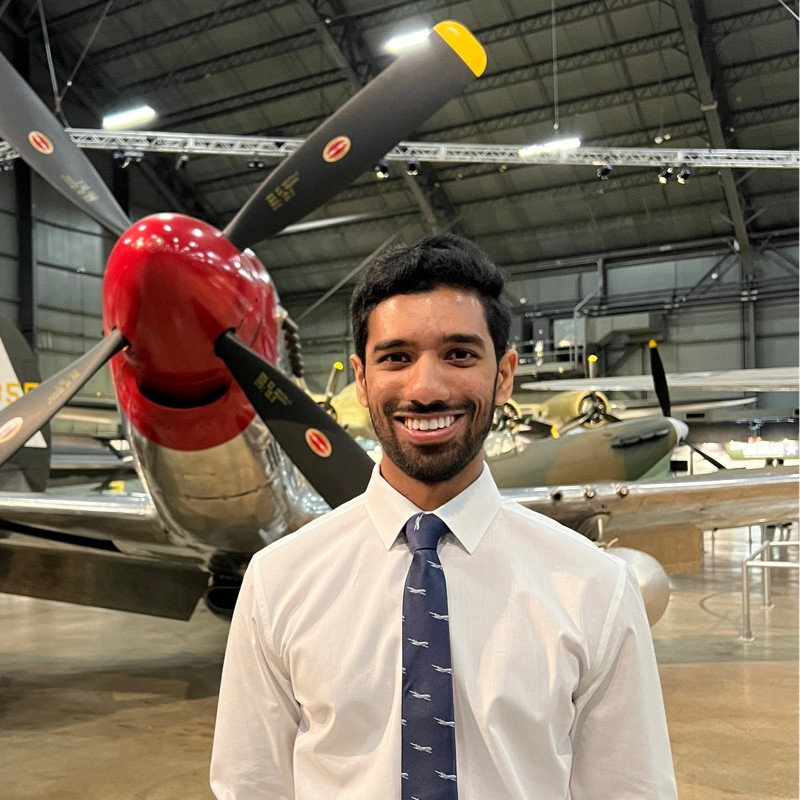

# Nevin Jestus

Source: student image cross-referenced against the publication list in `Sid_Most Recent_CV (Jan 2026).pdf`.

## Publications

### 1. Aerodynamic Characterization of Wing-Wing Interactions for Distributed Lift Applications.

- Citation: 47. Jestus, Nevin, Sidaard Gunasekaran, Michael P. Mongin, and Aaron Altman. "Aerodynamic Characterization of Wing-Wing Interactions for Distributed Lift Applications." In AIAA SCITECH 2023 Forum, p. 0030. 2023. https://doi.org/10.2514/6.2023-0030
- DOI: https://doi.org/10.2514/6.2023-0030
- Short abstract: Proximity effects due to wing-wing interactions were experimentally quantified as a function of gap and stagger across a wide range of different relative angles of attack (décalage). All experiments were conducted at the University of Dayton Low Speed Wind Tunnel (UD-LSWT) on a pair of Clark-Y AR 2 semi-span wings.

### 2. Aerodynamic Interactions among Three Identical Wings in Close Proximity.

- Citation: 54. Jestus, Nevin, Sidaard Gunasekaran, Michael P. Mongin, and Aaron Altman. "Aerodynamic Interactions among Three Identical Wings in Close Proximity." In AIAA 2023 Region III Student Conference, Dayton, OH https://doi.org/10.2514/6.2023-71488
- DOI: https://doi.org/10.2514/6.2023-71488
- Short abstract: The compactness requirements for modern Unmanned Aerial Vehicles (UAVs) and Private Air Vehicles (PAVs) opens the door for new innovative designs with smaller footprints. Some of the proposed UAV and PAV designs utilize multiple lifting surfaces or rotors in close proximity increasing the need for strategic placement of the wings within close proximity.

### 3. Proximity Effects of Wings on System Performance in a Multi-Wing Configuration.

- Citation: 57. Jestus, Nevin, Sidaard Gunasekaran, Michael Mongin, and Aaron Altman. "Proximity Effects of Wings on System Performance in a Multi-Wing Configuration." In AIAA SCITECH 2024 Forum, p. 1908. 2024. https://doi.org/10.2514/6.2024-1908
- DOI: https://doi.org/10.2514/6.2024-1908
- Short abstract: The emergence of compactness requirements in modern Unmanned Aerial Vehicles (UAVs) and Private Air Vehicles (PAVs) has led to the development of new aircraft design concepts, such as Distributed Lift where multiple small span wings are used as a substitute to the conventional large span monowing. Wing-wing interactions were experimentally and numerically quantified as a function of gap and stagger across a wide range of different relative angles of attack (décalage) for two, three, and four-wing configurations.
